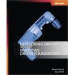

# Kernel Mode Driver Framework (KMDF)

  
## Introduction
If you are newcomer in KMDF and looking for very basic tutorials for writing it in assembly and c/c++ language. This repository is what you want in order to learn more about Windows driver. All of codes are compiled and tested based on WDK 7600 and Windows 7 x86 platform, enjoy !
  
### https://steward-fu.github.io/website/index.htm
